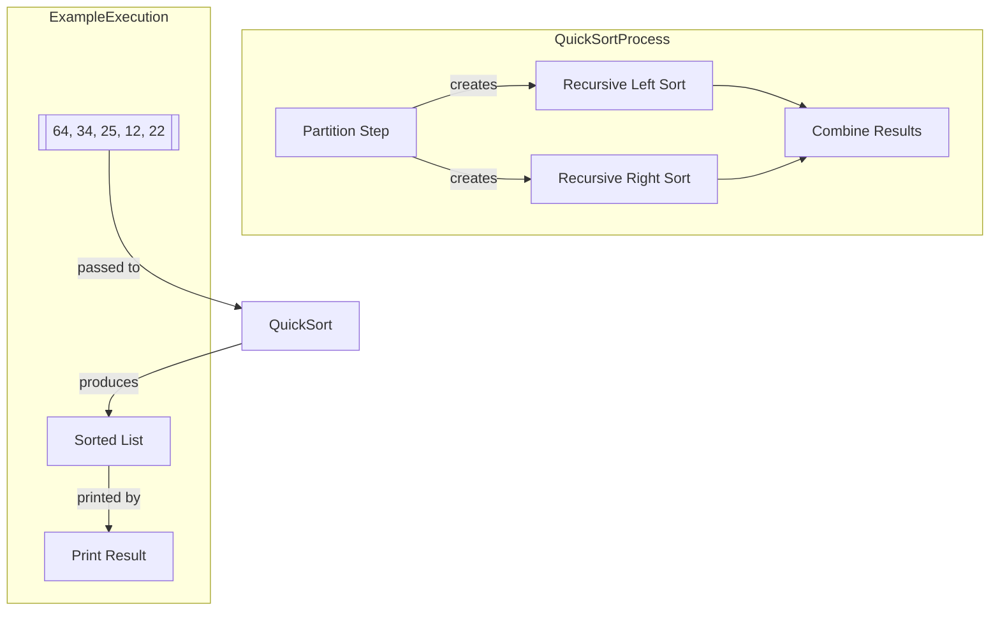

# QuickSort Implementation in Java

This repository contains a Java implementation of the QuickSort algorithm, 
a divide-and-conquer sorting technique with average O(n log n) time complexity.

## How to Run
1. Compile: `javac QuickSort.java`
2. Execute: `java QuickSort`

## Running Tests
Compile and run the test file:
```bash
javac -cp junit.jar QuickSortTest.java
java -cp junit.jar:. org.junit.runner.JUnitCore QuickSortTest
```

## Algorithm Diagram

